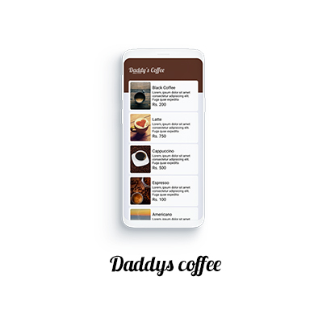

# DaddysCoffee

## Step 1
Clone the APP

## Step 2
###### change the api url in the app to something like this 

http://localhost:8088/api

change localhost to ip address

http://192.168.8.100:8088/api

## Step 3
1. Import database to MySql [/Database/Coffee.sql]
2. Run the Server

## Step 4
Build the App and Run on an Emulator

# Assumptions
1. Only one user using the app 
2. If user touches a product it will add as an order
3. order will be a number that will alter to currunt order number (imagine current order value is 1 it will increase by one - that part not developed in app)

